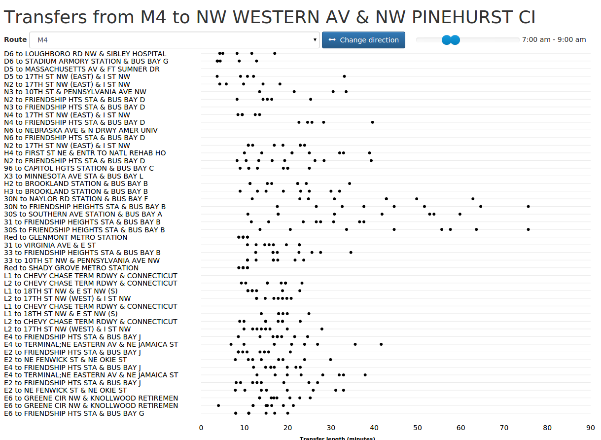

# pulsar: evaluate connection times by route

Connection times can greatly influence the users' perspective of a transit system. In a low-frequency environment, with
vehicles running once every half-hour or hour, the time to connect between two vehicles can dominate the total trip time.
This tool allows one to visualize connection times on a route-by-route basis, to see which connections are performing well
or poorly.

## Installation

Installation should be pretty simple. Create a directory `gtfs` in the root directory of the checkout and copy your GTFS
file into that directory. Call it `baseline.zip`. (This name is hardwired in the code; changing this is planned). Then
type `./activator run -mem 2048`, adjusting the memory allocation as needed, to start the tool. Load `http://localhost:9000`
and select a route and a direction to visualize transfer times. You can filter the transfer times by time of day using
the range slider. Each dot represents a transfer.

## Filtering

The connections are filtered using the following rules:

- When there are multiple contiguous stops where one can connect from Route A to Route B, only the first and last will
  be shown.
- Connections longer than 90 minutes are filtered out as unreasonable, under the assumption that they are not connections
  anyone would make and thus do not affect the users' experience of the system.
- Connections from Route A that occur before Route B is running are filtered (in practice, if 3 vehicles on route A arrive
  before the first vehicle arrives on route B, the first two vehicles on route A are ignored. This only applies at the
  start of the day; if service is split in two pieces (e.g. morning and afternoon rush), this filtering does not apply
  to the second span.)
